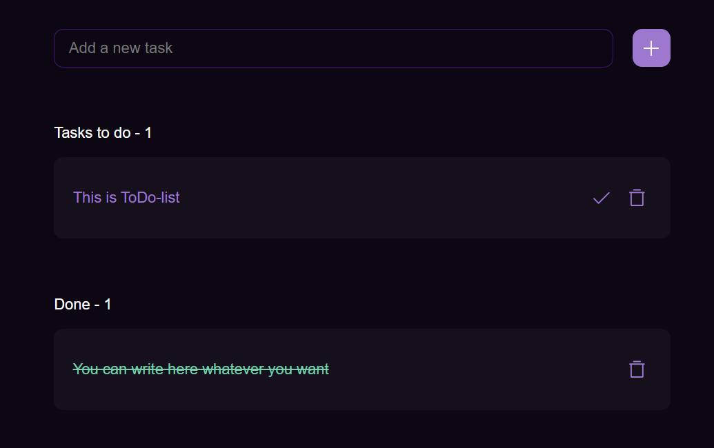

# 📝 ToDo List - Мой первый React-проект

Простое и функциональное приложение для управления задачами, разработанное на React. Позволяет добавлять, отмечать выполненными и удалять задачи.

## 🚀 Особенности

- **Добавление задач**: Введите текст в поле и нажмите Enter/кнопку "+"
- **Статус задач**: Разделение на активные и выполненные
- **Счетчики**: Отображение количества активных и завершенных задач
- **Адаптивный дизайн**: Корректно отображается на разных устройствах

## 🛠 Технологии

- React (Hooks)
- CSS (без дополнительных библиотек)
- Flexbox для верстки

## 📦 Установка и запуск

1. Клонировать репозиторий:
```bash
git clone https://github.com/c4inusiii/react-todo.git
Установить зависимости:
npm install

Запустить приложение:
npm start
Приложение будет доступно по адресу: http://localhost:3000, а также откроется в вашем браузере

🤝 Как можно помочь
Буду рад любым предложениям и pull request'ам! Открыт для сотрудничества.

Разработано с ❤️ c4inusiii | 2025
